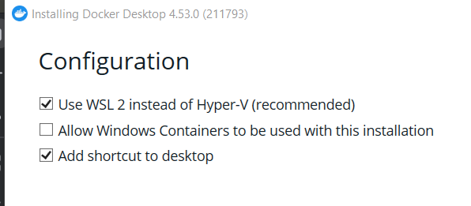
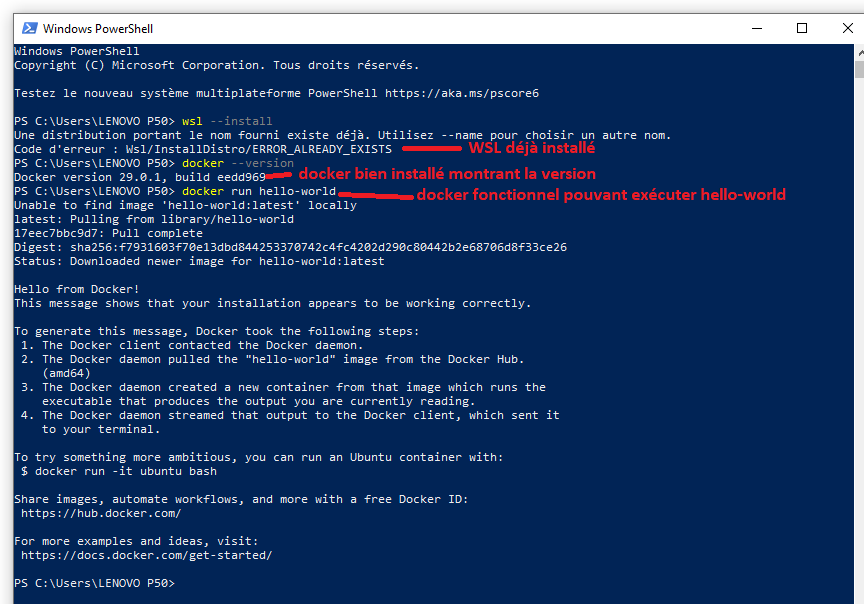
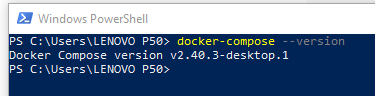

# Docker Basics - Utilisation basique de docker

Docker est une plateforme permettant de développer, emballer et exécuter des applications dans des **conteneurs** légers
et portables. Un conteneur contient tout ce nécessaire (code, dépendances, runtime) pour faire fonctionner l'application
de manière cohérente sur n'importe quel environnement, qu'il soit local, en staging ou en production.

## Concepts clés :

- **Conteneurs** : Environnements isolés pour exécuter des applications.
- **Images** : Modèles en lecture seule pour créer des conteneurs.
- **Dockerfile** : Fichier de configuration pour construire des images.
- **Volumes** : Permet de persister des données entre les conteneurs.
- **Docker Hub** : Registre d'images publiques et privées.
- **Réseaux** : Permet la communication entre conteneurs et avec le monde extérieur. Docker offre plusieurs types de
  réseaux :
    - **Bridge** : Réseau par défaut pour les conteneurs sur une même machine.
    - **Host** : Utilise le réseau de l'hôte pour les conteneurs.
    - **Overlay** : Réseau multi-hôtes pour les clusters (Docker Swarm, Kubernetes).
    - **Macvlan** : Permet à un conteneur d'avoir une adresse MAC distincte.

## Portabilité :

Docker fonctionne sur **Linux**, **Windows** et **macOS**. Sur Linux, il utilise directement le noyau du système, tandis
que sur Windows et macOS, Docker utilise une machine virtuelle (VM) pour simuler un noyau Linux.

## Comparaison avec les machines virtuelles (VM) :

- **Docker (conteneurs)** : Plus léger et plus rapide que les VM. Les conteneurs partagent le noyau de l'hôte et sont
  isolés de manière efficace. Ils sont également plus rapides à démarrer et consomment moins de ressources.
- **Machines virtuelles (VM)** : Nécessitent un système d'exploitation complet pour chaque machine virtuelle. Chaque VM
  dispose de son propre noyau, ce qui ajoute une surcharge importante en termes de ressources et de temps de démarrage.
  Les VM sont souvent plus lentes et moins efficaces que les conteneurs Docker.

## Commande simple :

Pour lancer un conteneur hello-world :

```bash
docker run hello-world
```

[images]()

## docker-compose

Docker Compose est un outil qui permet de définir et de gérer des applications multi-conteneurs Docker via un fichier
YAML. Il simplifie le démarrage, l'arrêt et l'orchestration de plusieurs conteneurs, comme un serveur web et une base de
données, en utilisant une seule commande.

Commandes clés :

- docker-compose up : démarre les services.

- docker-compose down : arrête et supprime les services.

Il permet de gérer facilement des environnements complexes avec des volumes et des réseaux pour les conteneurs.

## Installation de Docker sur Windows

### Prérequis :

- Windows 10 (Pro, Enterprise, Education) ou Windows 11.
- Virtualisation matérielle activée dans le BIOS.
- Avoir le droit Administrateur.

### Étapes d'installation :

1. Téléchargez Docker Desktop depuis [docker.com](https://www.docker.com/products/docker-desktop).
2. Exécutez l'installateur et suivez les instructions.

- PS: Choisir WSL 2 au lieu de Hyper-V pour une meilleure expérience.
    <p align="left">
      
    </p>
- L'ordinateur pourrait demander un redémarrage ou déconnexion de l'utilisateur après l'installation.

3. Activez **WSL 2** si nécessaire (`wsl --install` dans PowerShell en tant qu'administrateur).
4. Lancez Docker Desktop.
5. Vérifiez l'installation :
   ```bash
   docker --version
   docker run hello-world
   ```
   <p align="left">
      
    </p>

### Problèmes courants

- Assurez-vous que Hyper-V et la virtualisation sont activés dans le BIOS.
- Si WSL ne fonctionne pas correctement, réinstallez ou mettez à jour WSL.

## Installation de docker-compose sur Windows

Une fois docker desktop est installé, docker compose est installé automatiquement.
Pour vérifier l'installation taper la commande suivante sur PowerShell.

``` bash 
    docker-compose --version
``` 



## Retourner sur la page d'acceuil en cliquant le lien suivant:

[acceuil](../README.md)


